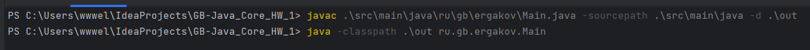
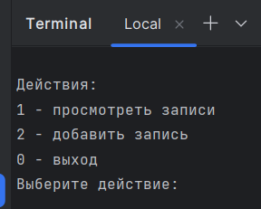
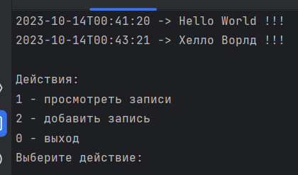

# Урок 1. Компиляция и интерпретация кода

1. Создать приложение с вложенностью пакетов не менее 3х, где будет класс для входа и несколько классов с логикой. Пример: приложение для внесения заметок во внешний файл с обязательной фиксацией времени
пример:
   * Введите заметку: Hello, world!
   * Дозапись в файл: 16.07.2023 -> Hello, world

    Скомпилируйте и запустите посредством CLI.

---
   
---

---
2. (доп).Создать два Docker-образа. 
    * Один должен компилировать Java-проект обратно в папку на компьютере пользователя, 
    * а второй забирать скомпилированные классы и исполнять их. 
    
   Пример листинга для docker-compose приведен в презентации семинара

_*Задание 2 не успел выполнить в связи с завалом на работе (((*_